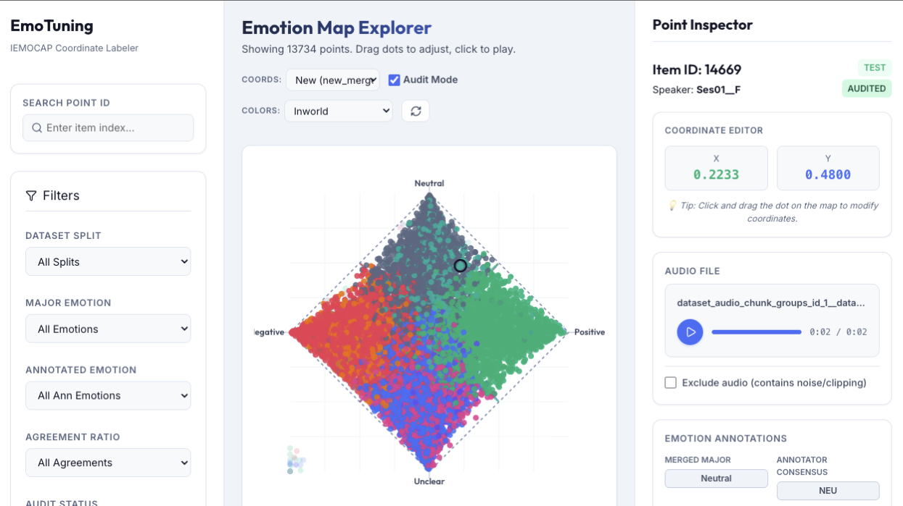

# EmoTuning Labelling App

EmoTuning is a labeling application designed for speech emotion recognition and coordinate tuning. It provides a visual interface for tuning and annotating emotional coordinates of audio chunks, helping speech researchers align model outputs with human annotations.

## Project Structure

This application is split into two components:
- **Backend**: A FastAPI server that handles coordinate calculations, retrieves audio metadata, and serves API endpoints. See [backend/README.md](backend/README.md) for execution and development server details.
- **Frontend**: A React application built with Vite providing the user interface. See [frontend/README.md](frontend/README.md) for how to start the development server.

## Interface Preview

Below is a preview of the EmoTuning application in action:

