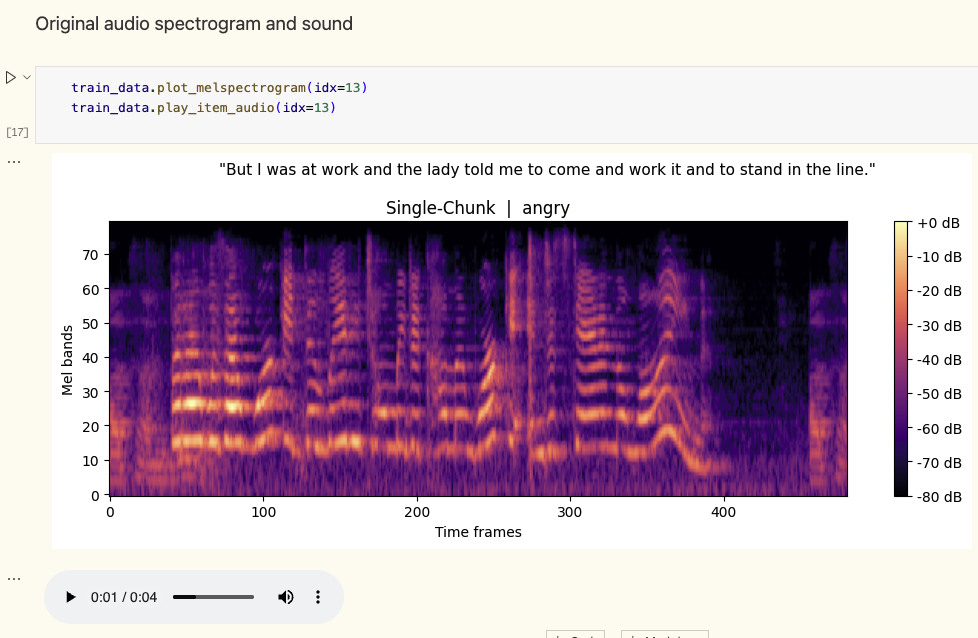
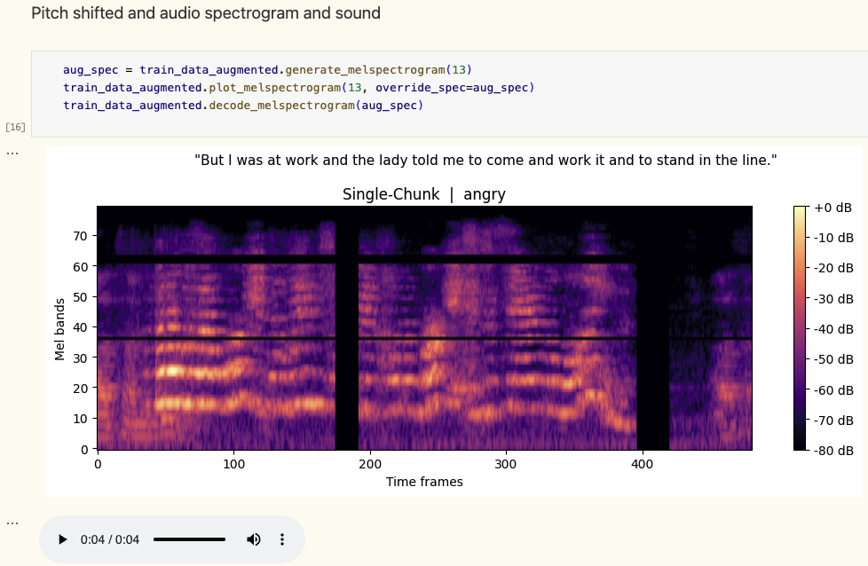

# Shared Dataset Loader

This folder hosts the dataset loader utilities and core tools used across the speech emotion recognition pipeline.

## Dataset Repository & Package

The logic is built using [nbdev](https://nbdev.fast.ai/), a literate programming environment for Python package development. It allows writing documentation, code, examples, and tests (like inline asserts) all within Jupyter Notebooks.

*   **Centralized Repository**: [gofordiego/nbdev-upc-aidl-iemocap-datasets](https://github.com/gofordiego/nbdev-upc-aidl-iemocap-datasets)
*   **Documentation Site**: [GitHub Pages Documentation](https://gofordiego.github.io/nbdev-upc-aidl-iemocap-datasets/)
*   **Literate Programming Example**: See [00_core.ipynb](https://github.com/gofordiego/nbdev-upc-aidl-iemocap-datasets/blob/main/nbs/00_core.ipynb) where cells starting with `#| export` define the exported package code.

---

> [!NOTE]
> **Git Subtree Integration**
> We have added the dataset loader project as a git subtree in [nbdev-upc-aidl-iemocap-datasets/](nbdev-upc-aidl-iemocap-datasets/) for easy local reference and browsing.
>
> However, please note that when running the **Train CLI**, the python package is dynamically installed/retrieved directly from the public GitHub repository rather than referencing this local folder.

## Example of Usage

This is an example of how to use the dataset loader package:

### Initialization

```python
factory = DatasetsFactory(url="https://iemocap-files.plumberslog.com/")
```

```bash
Downloading audio chunk dataset groups manifest...
Audio Chunk Dataset Groups Manifest: 100%|██████████| 2.20k/2.20k [00:00<00:00, 3.31MB/s]
Checking DB Version: 100%|██████████| 66.0/66.0 [00:00<00:00, 94.3kB/s]
Downloading IEMOCAP SQLite database...
IEMOCAP SQLite DB:   8%|▊         | 122M/1.45G [00:02<00:18, 71.7MB/s]
IEMOCAP SQLite DB:  63%|██████▎   | 913M/1.45G [00:13<00:06, 78.8MB/s]
IEMOCAP SQLite DB: 100%|██████████| 1.45G/1.45G [00:19<00:00, 73.7MB/s]
Downloading External Audio Source SQLite database...
External Audio Source SQLite DB:  46%|████▌     | 424M/924M [00:04<00:05, 89.2MB/s]
External Audio Source SQLite DB: 100%|██████████| 924M/924M [00:09<00:00, 93.9MB/s]
Downloading group_id_1__last_export_1779979932.parquet...
group_id_1__last_export_1779979932.parquet: 100%|██████████| 768k/768k [00:00<00:00, 53.3MB/s]
```

```python
factory.get_dataset_audio_chunk_groups()
```

| | id | chunk_threshold_seconds | previous_overlap_seconds | sample_rate | last_export_filename |
|---|---|---|---|---|---|
| **0** | 1 | 4.8 | 0.2 | 16000 | `https://files.plumberslog.com/dataset_audio_chunks/group_id_1_...` |
| **1** | 2 | 4.8 | 0.2 | 16000 | `https://files.plumberslog.com/dataset_audio_chunks/group_id_2_...` |
| **2** | 3 | 3.5 | 1.0 | 16000 | `https://files.plumberslog.com/dataset_audio_chunks/group_id_3_...` |
| **3** | 4 | 4.5 | 1.0 | 16000 | `https://files.plumberslog.com/dataset_audio_chunks/group_id_4_...` |
| **4** | 5 | 9.0 | 1.0 | 16000 | `https://files.plumberslog.com/dataset_audio_chunks/group_id_5_...` |


### Selecting dataset audio chunks and splits:

```python
train_data = factory.build_dataset(
    partition_type="train",
    id=2,
    n_fft=1024,
    hop_length=160,
    win_length=400,
    n_mels=80,
    pad_mode="windowed_repeat",
    should_refresh_local_cache=False,
)
print(f'\nTrain: {len(train_data)} chunks')

validation_data = factory.build_dataset(
    partition_type="validation",
    id=2,
    n_fft=1024,
    hop_length=160,
    win_length=400,
    n_mels=80,
    pad_mode="windowed_repeat",
    should_refresh_local_cache=False,
)
print(f'Validation: {len(validation_data)} chunks')

test_data = factory.build_dataset(
    partition_type="test",
    id=2,
    n_fft=1024,
    hop_length=160,
    win_length=400,
    n_mels=80,
    pad_mode="windowed_repeat",
    should_refresh_local_cache=False,
)
print(f'Test: {len(test_data)} chunks')
```


### Visualizing and listening dataset's audio chunks:




### Spec Augment and Pitch Shift



